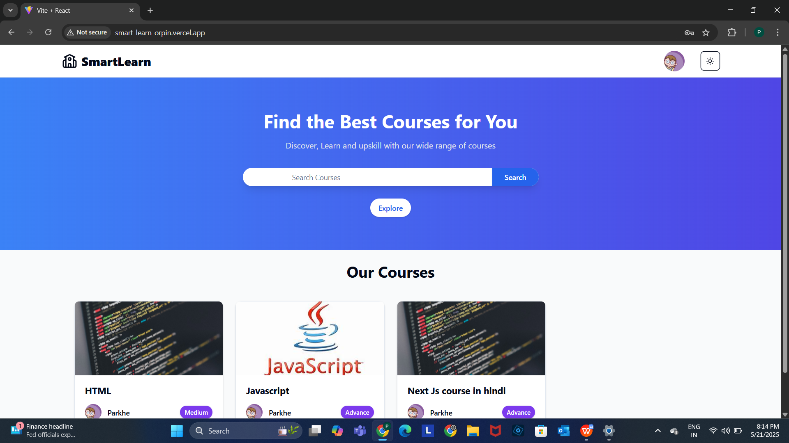
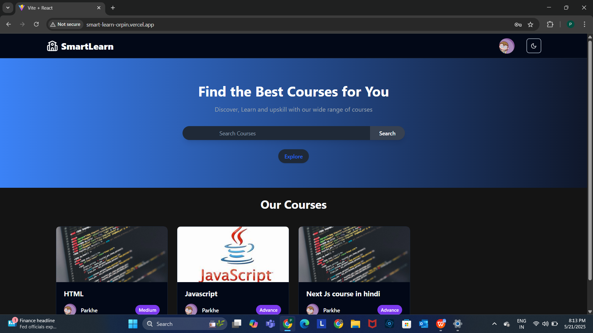
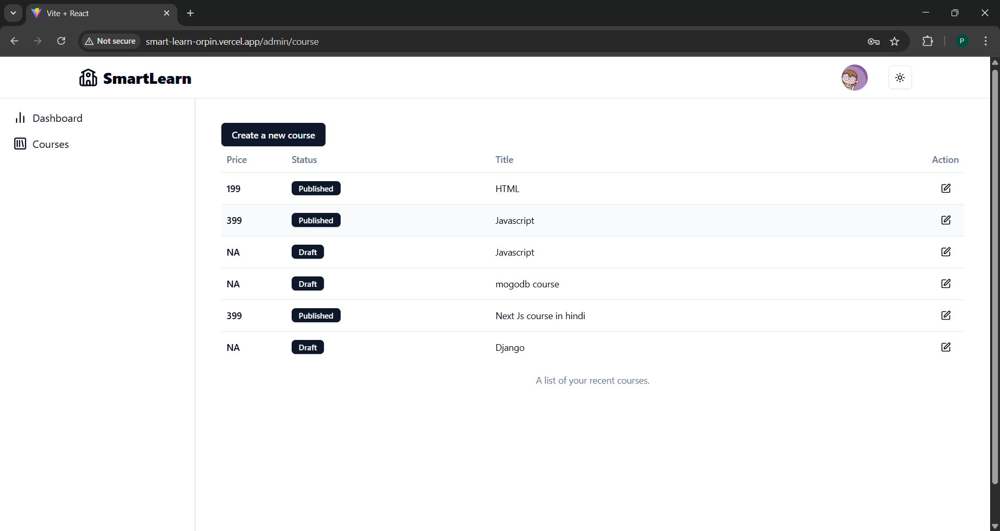
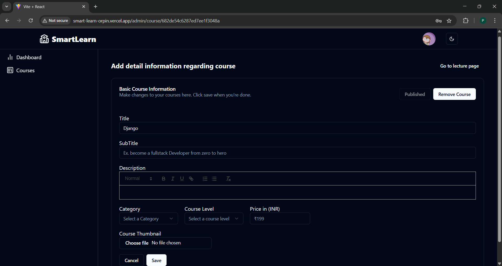
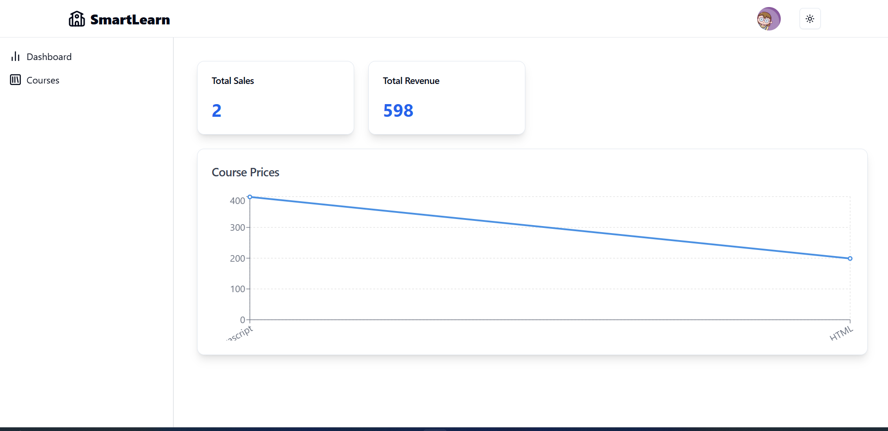

# Priti Parkhe — Full-Stack Engineer

I build production-ready web apps end-to-end — JWT-secured REST APIs to responsive React UIs.
Specializing in the **MERN stack** with real payment and cloud media integrations.

---

## 🔗 Live Demo

**[SmartLearn LMS → smart-learn-orpin.vercel.app](https://smart-learn-orpin.vercel.app)**

| Role | Email | Password |
|---|---|---|
| Student | student@gmail.com | 123456 |
| Instructor | instructor@gmail.com | 123456 |

---

## 🛠 Tech Stack


---

## 📦 SmartLearn LMS

A full-stack Learning Management System built for two user types — students and instructors —
with course management, media hosting, and payment processing.

**What it does:**
- Instructors create and manage courses, upload video/PDF lecture materials, edit or delete content
- Students browse, search, filter, and enroll in courses — including paid courses via Stripe
- Role-based access control across all routes, secured with JWT

**Tech:** React + RTK Query · Node.js/Express · MongoDB · Cloudinary · Stripe · JWT · Tailwind CSS

**Built features:**
- 🔐 JWT authentication — register, login, role-based route protection
- 📚 Course creation, editing, deletion (instructor)
- 🎬 Video + PDF upload via Cloudinary signed URLs
- 💳 Stripe Checkout — server-side session, webhook-verified enrollment
- 🔍 Course search and category filter
- 🌗 Light/Dark mode — persisted across sessions
- 📊 Admin analytics dashboard — system-wide course and user metrics

**Architecture highlights:**
- **RTK Query** handles all API state — no manual loading/error boilerplate
- **Cloudinary pipeline** — async media upload with format validation
- **Stripe webhook** — enrollment only confirmed after payment verified server-side
- **MongoDB** — separate collections for users, courses, lectures, and enrollments

---

## ⚙️ Installation

### 1. Clone the repository

```bash
git clone https://github.com/PritiParkhe/SmartLearn
cd SmartLearn
```

### 2. Install dependencies

```bash
# Backend
cd server
npm install

# Frontend
cd ../client
npm install
```

### 3. Set up environment variables

Create a `.env` file inside the `server` directory:

```env
MONGO_URI=your_mongodb_connection_string
PORT=5000
SECRET_KEY=your_secret_key
FRONTEND_URL=http://localhost:5173

# cloudinary 
API_KEY=your_cloudinary_api_key
API_SECRET=your_cloudinary_api_secret
CLOUDINARY_NAME=your_cloudinary_name

#stipe
STRIPE_PUBLISHABLE_KEY=your_stripe_publishable_key
STRIPE_SECRET_KEY=your_stripe_secret
WEBHOOK_ENDPOINT_SECRET=your_webhook_endpoint_ secret
```

### 4. Run the app

```bash
# In /server
npm start        # → http://localhost:5000

# In /client
npm start        # → http://localhost:3000
```

---

## 🖼 Screenshots

| Home (Light) | Home (Dark) |
|---|---|
|  |  |

| Course Catalog | Course Detail |
|---|---|
|  |  |



---

## 🚧 Roadmap

- [ ] Quiz and assignment module
- [ ] Student progress tracking dashboard
- [ ] Real-time notifications
- [ ] Discussion forums per course

---

## 📈 Currently Learning / Open To

| Sharpening | Exploring | Available for |
|---|---|---|
| TypeScript, Docker, GitHub Actions CI/CD | Next.js App Router, server components, edge runtimes | Full-stack / backend SDE-1 or SDE-2 roles |

---

## 📬 Let's Connect

Hiring or building something interesting? I respond within 24 hours.

- 📧 **Email:** [parkhepriti47@gmail.com](mailto:parkhepriti47@gmail.com) ← *preferred*
- 💼 **LinkedIn:** [linkedin.com/in/priti-parkhe](https://www.linkedin.com/in/priti-parkhe)
- 🐙 **GitHub:** [github.com/PritiParkhe](https://github.com/PritiParkhe)
