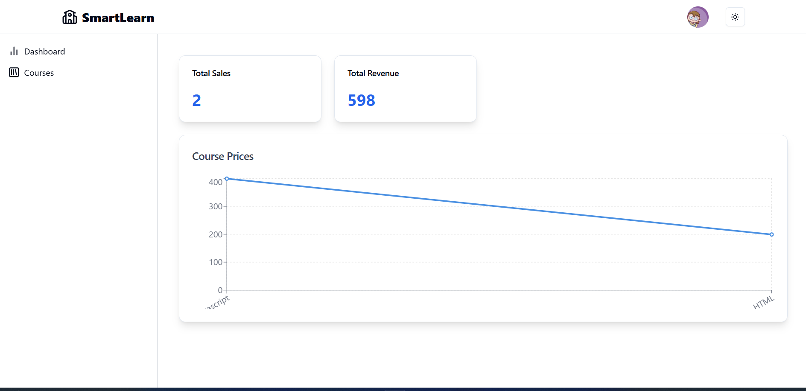

```markdown
# SmartLearn

SmartLearn is a simple yet effective Learning Management System designed to streamline the learning experience for both students and instructors. It offers features like course creation, enrollment, lecture material upload/viewing, quizzes, progress tracking, and more — all in a clean and user-friendly interface.
To add a **demo link** to your SmartLearn LMS README, include it prominently near the top so users can quickly access it. Here’s how you can format it:

---

## 🔗 Live Demo

**🌐 [SmartLearn LMS – Live Demo](https://smart-learn-orpin.vercel.app)**

> Explore the platform as a student or instructor.
> *(Demo login: [student@example.com](mailto:student@example.com) / [instructor@example.com](mailto:instructor@example.com) – password: `demo123`)*


## Features

- 👨‍🏫 Instructor & Student Roles – Role-based access to manage or enroll in courses.
- 📚 Course Creation & Enrollment – Instructors can create courses; students can enroll easily.
- 📄 Lecture Materials Upload/View – Upload or access PDFs, videos, and more.
- ✅ Quizzes & Assignments – Students can submit work; instructors can grade.
- 📈 Track Student Progress – Visualize completion and performance metrics.
- 🔒 Secure Authentication – JWT-based user login, register, and session handling.
- 📑 Course & Lecture Management – Instructors can edit/delete course content.
- 🔍 Search & Filter Courses – Find relevant courses quickly using keywords/categories.
- 🏅 Progress Tracking – Students mark completed lectures; instructors see progress.
- 🌗 Light/Dark Mode – Personalized theme toggle saved across sessions.

## Tech Stack

- **Frontend**: 
  - **React.js** with **Hooks** for dynamic UI.
  - **Redux Toolkit (RTK Query)** for state management and API integration.
  - **Tailwind CSS** for styling and responsive design.
  
- **Backend**: 
  - **Node.js** and **Express.js** for building APIs.
  - **MongoDB** for storing user data, courses, and quiz results.
  - **JWT** for authentication and authorization.
  - **Cloudinary** for media storage (course videos, images).
  - **Stripe API** for payment processing.

## Installation

### Clone the repository

```bash
git clone https://github.com/PritiParkhe/SmartLearn
```

### Install dependencies

#### Backend

```bash
cd backend
npm install
```

#### Frontend

```bash
cd client
npm install
```

### Set up environment variables

Create a `.env` file in the **backend** directory and add the following:

```bash
MONGO_URI=your_mongodb_connection_string
JWT_SECRET=your_jwt_secret_key
CLOUDINARY_URL=your_cloudinary_url
STRIPE_SECRET_KEY=your_stripe_secret_key
PORT=5000
```

### Running the application

#### Backend

In the **backend** folder:

```bash
npm start
```

This will start the backend server on **http://localhost:5000**.

#### Frontend

In the **frontend** folder:

```bash
npm start
```

This will start the frontend on **http://localhost:3000**.

## Usage

1. **Sign Up / Log In**: Create a new user account or log in with existing credentials.
2. **Browse Courses**: Explore available courses based on your interests.
3. **Enroll in Courses**: Select and enroll in courses of your choice.
4. **Take Quizzes**: Complete quizzes at the end of each course to reinforce your learning.
5. **Track Progress**: Keep track of your learning progress through your personal dashboard.
6. **Admin Features**: Admins can add or manage courses, including uploading videos and documents.
7. **Make Payments**: Pay for premium courses using Stripe's secure payment gateway.

## Screenshots

### Home Page


### Course Catalog


### Dashboard



### Course Details


## Roadmap
Roadmap
✅ Real-time notifications
⏳ Chat & discussion forums
⏳ Admin dashboard for system analytics
⏳ Mobile app integration (React Native)
⏳ Multi-Language Support**: Add support for multiple languages to cater to a global audience.

## Contributing

Contributions are welcome! If you find a bug or want to add a feature, feel free to open an issue or submit a pull request. 

1. Fork the repository.
2. Create a new branch (`git checkout -b feature/your-feature`).
3. Commit your changes (`git commit -am 'Add new feature'`).
4. Push to the branch (`git push origin feature/your-feature`).
5. Create a new pull request.

## License

This project is licensed under the MIT License - see the [LICENSE](LICENSE) file for details.
```
